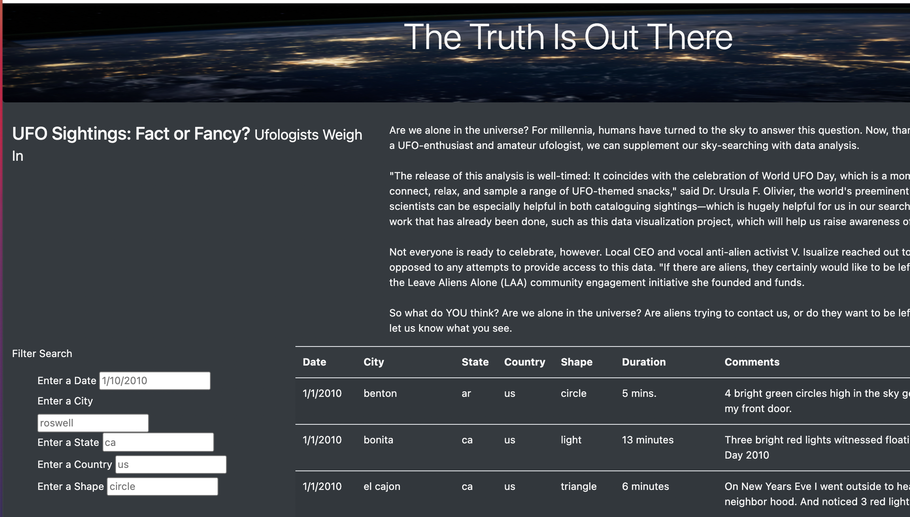
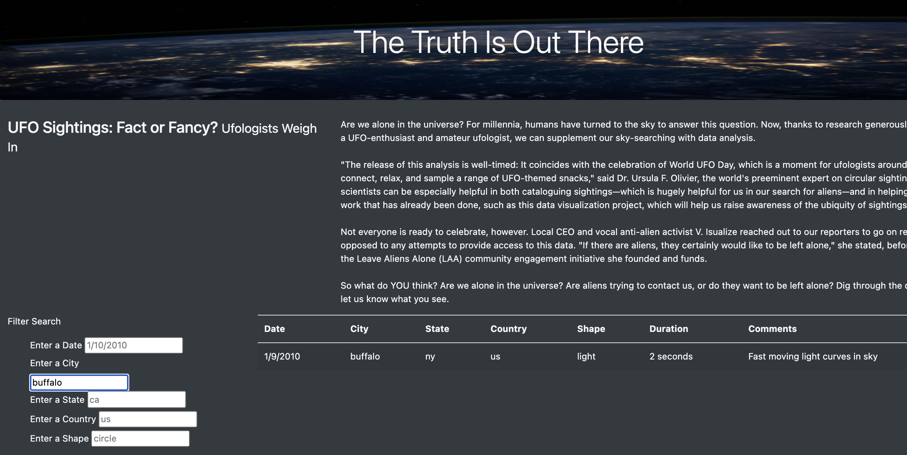

# UFO Data Project

## Overview of Project
The purpose of this project was to take a dataset of UFO sightings and create an accesible website for anyone to access the full dataset as well as filter the data by a variety of parameters to get the information most relevant to them.

## How to Utilize the Website
### Unfiltered Data
When a user accesses the website, they'll land on the main page with the full list of UFO sitings loaded. The filter options will be visible in the left column with placeholders for filter examples. Screenshot of the main page is here:

### Filtered Data
With all the filter options available, there are a variety of ways to slice and dice the UFO sighting data. A user can filter by as many of the five available filters as they'd like, or choose only one. In this example, the data has been filtered only by the city "Buffalo." This allows users the flexibility to organize the data in the most meaningful way for their own analyses. Do they care about a particular city, or state, or both? There are many ways to configure the data.

Data filtered by city "Buffalo":

  
## Summary 
### Drawbacks of the Current Design 
Despite having multiple filters to customize the UFO sightings data, there are a few limitations to the current design. Some identified issues include:
- The filter funtionality lacks clear instructions. It may be confusing that there are no indications of whether a user should press enter in order to filter, or if a user has to use all the filters or can select from any one of them.
- A user may have to search many states, cities, dates, etc. before finding a selection that has available data. 

### Suggestions for Further Development
To improve on the functionality of the website in the future, some considerations for future updates to the code are listed below:
- The filter functionality would be more impactful as a dropdown, where all available options are visiible.
- The website could be improved with a log of when the data was most recently updated. Currently, the dataset only includes UFO sightings from January 2010 and this is not immediately known. Indicating that the data includes information from January 2010 only (or updated to include the new data range if the dataset was expanded) could save a user a lot of time searching for data that doesn't exist. 
-  Also, if the dataset will only ever include UFO sighting data from the US (as indicated by the "State" filter), the "Country" filter could be removed to avoid confusion.
-  Finally, a download function could be added to allow users to download the .csv file of their filtered data. Or, a FAQ page could be added with information on whether data scraping is allowed on this site.
